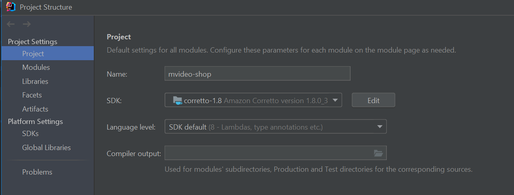
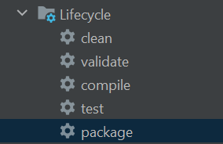
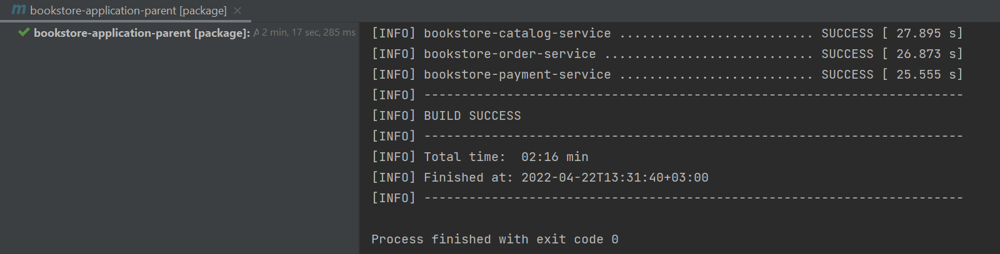
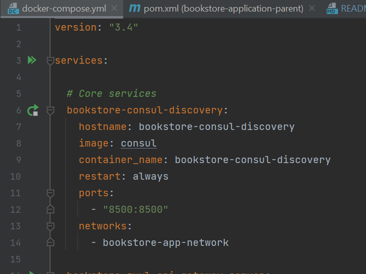
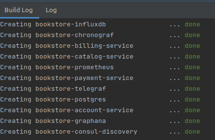

# Backend Java Microservice Ecommerce

>Backend Services Start Instruction


Open project in IntelliJ IDEA, open menu File-> Project structure -> Project settings -> Project -> SDK  and choose Java SDK 1.8



In IntelliJ IDEA, open maven tab on the right side and press Lifecycle -> package.



Wait while the build finish.



Install docker desktop application on computer.

Open docker-compose file in IntelliJ IDEA and press two green arrows in the beginning of the file.



Wait while docker containers are up 



Use the `Postman Api collection` in the Postman directory. To make request to various services.

>Tasks list:

```

>Bug fix list

1. Fix CORS problem.
    The current version of the system does not support the PATCH method, add it so CORS will work for it as well.
    Hint: Access-Control-Allow-Methods
    bookstore-commons/src/main/java/com/devd/spring/bookstorecommons/security/SimpleCorsFilter.java
    Line 30 - write methods there except for PATCH
2. Сreation of cart doesn't work. Fix it in cart controller.
    When send POST to /cart API it responses with null body.
    Hint: class CartController, method createCart
    Line 26-28 - fix the code to create cart.
3. Creation of user doesn't work. Fix it in user account service.
    When send POST to /user API it responses with null body.
    Hint: class UserController, method createUser
    Line 41 - fix the code to create user.

>Feature list

1. Develop search feature for goods. Goods should be searched by name.
2. Develop compare feature for goods. Goods should by parameters and price.
3. Develop content management capabilities feature. Develop backend part of admin panel for adding goods.