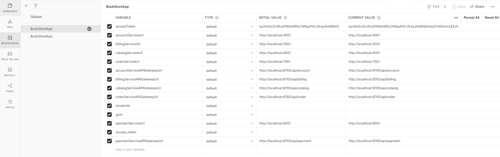

# Интернет-магазин, сервер на Backend Java Microservices

>Инструкция по запуску сервера

Откройте проект в IntelliJ IDEA, откройте меню File-> Project structure -> Project settings -> Project -> SDK и выберите Java SDK 1.8


В IntelliJ IDEA, откройте закладку maven в верхней правой части среды разработки и нажмите Lifecycle -> package.


Дождитесь окончания сборки проекта.


Установите программу docker desktop application на Ваш компьютер.

Откройте файл docker-compose в IntelliJ IDEA и нажмите двойную зеленую стрелку в начале файла.


Дождитесь окончания создания docker контейнеров. 


Установите программу Postman на Ваш компьютер.

Импортируйте файлы `Postman Api collection` из папки Postman в программу Postman.


Перейдите во вкладку Environments и выберите коллекцию BookstoreApp. 



Запрос Get OAuth Token по адресу {{accountServiceAPIGatewayUrl}}/oauth/token должен возвращать ответ:


Запрос Get All Products {{catalogServiceAPIGatewayUrl}}/products?sort=updatedAt,DESC&page=0&size=4 должен возвращать ответ:


>Список задач для доработки:

```

Список багов в ПО для устранения:

1. Проблема CORS.
    Текущая версия системы не поддерживает метод PATCH, добавьте его, чтобы CORS работал и для него. 
    Подсказка: Access-Control-Allow-Methods
    bookstreo-commons/src/main/java/com/devd/spring/bookstorecommons/security/SimpleCorsFilter.java
    30 строка - прописать туда методы кроме PATCH
2. Не работает создание корзины. Исправьте это в контроллере корзины cart controller.
    При отправке POST в /cart API он отвечает null body.
    Подсказка: класс CartController, метод createCart
    Строка 26-28 - исправить код для создания корзины.
3. Создание пользователя не работает. Исправьте это в службе учетных записей пользователей user account service.
    При отправке POST в /user API он отвечает null body.
    Подсказка: класс UserController, метод createUser
    Строка 41 - исправить код для создания пользователя.

Список новых задач с новой фунециональностю для разработки:

1. Разработать функцию поиска товаров.
    Добавить возможность поиска товаров. Товары следует искать по названию.
    Подсказка: начать с класса ProductController, написать метод похожий на getProduct
    Строка 51-57: создать похожий контроллер и далее сервис по поиску товаров, но не по productId, а по productName.
2. Разработать функцию фильтрации товаров по цене.
    Добавить возможность возвращать только товары, попадающие в ценовой диапазон.
    Подсказка: сделать фильрацию товаров по полю price
3. Разработать функцию возвращения товаров по рейтингу.
    Добавить возможность возвращать только товары, с минимальным указанным рейтингом.
    Подсказка: сделать фильрацию товаров по полю averageRating.